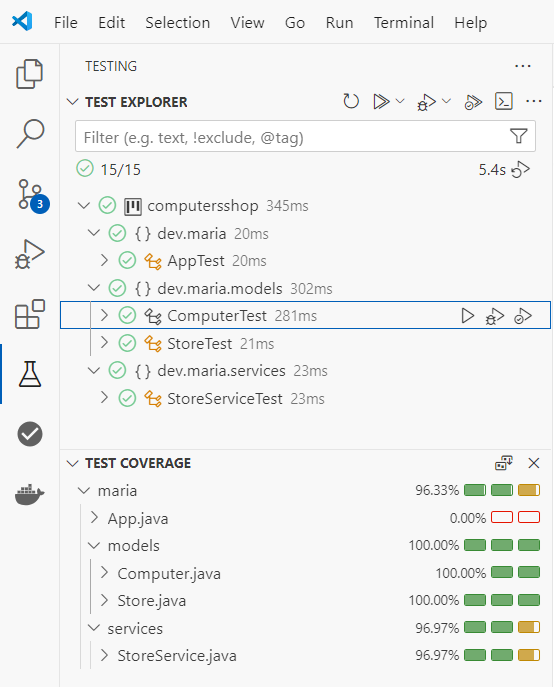

# Computer Shop

This repository is part of coursework for the Full Stack Web Development course from [Factoria F5](https://factoriaf5.org).

## Requirements

**A program needs to be developed to model a computer store. The store has the following attributes:**

- Store number.
- Store owner.
- Store tax identifier.

**The computers in the store have the following attributes:**

- Computer brand.
- Memory capacity.
- Processor features.
- Operating system.
- Computer price.

**The program must have methods that allow:**

- Adding a computer to the store.
- Removing a computer from the store based on its brand.
- Searching for a computer in the store based on its brand.
- Listing the information of all the computers the store has.

## UML Diagram

## Test

